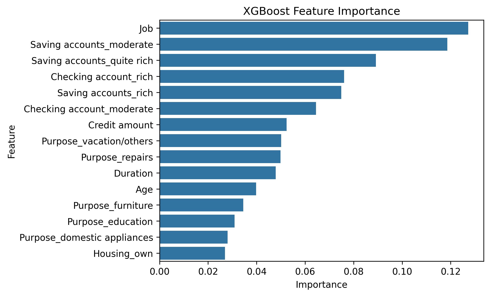

#  Credit Risk Classification Pipeline

## Project Overview
This project builds a predictive machine learning pipeline to assess customer default risk. By leveraging historical financial data, the goal is to accurately classify customers into risk categories, enabling data-driven lending decisions and minimizing potential business losses.

##  Repository Contents
* `01_Data_Exploration_and_Cleaning.ipynb`: Initial EDA, handling missing values, and analyzing the distribution of default classes.
* `02_Model_Training_and_Tuning.ipynb`: Implementation of baseline models and hyperparameter tuning of the core XGBoost classifier.
* `03_Feature_Importance_and_Evaluation.ipynb`: Extraction of top driving features and final business-metric evaluation.

##  Model Performance & Business Strategy

* **Algorithm:** Tuned XGBoost Classifier
* **Overall Accuracy:** ~83.5%
* **Recall (Default Cases):** >75%
* **Business Logic:** In credit risk evaluation, a False Negative (missing a customer who defaults) carries a significantly higher financial cost than a False Positive (over-flagging a safe customer). Therefore, this model was strictly tuned to prioritize **Recall** over raw accuracy.

##  Key Takeaways
* **Interpretability:** Beyond raw predictions, the model provides strong interpretability through feature importance extraction, allowing business stakeholders to clearly understand the key drivers behind default risk.
* **Production Readiness:** The final XGBoost pipeline provides a strong balance between predictive speed, performance, and interpretability, making it highly suitable for integration into a live credit-scoring API.
